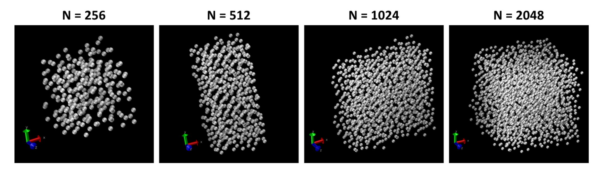
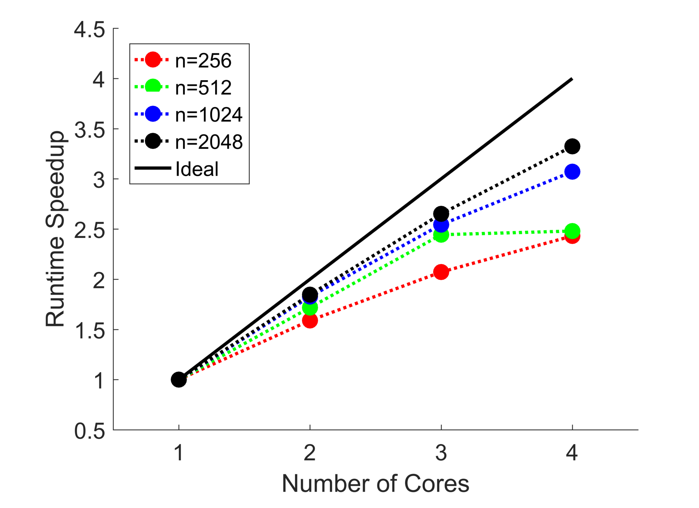

# Parallel Molecular Dynamics
Explores various parallelization algorithms for speeding up molecular dynamics simulations.
 

  

Molecular dynamics simulations explore solid and fluid properties at a molecular level. Simulations of interest are generally quite large, and require a significant amount of computing power to integrate the equations of motion over the time range of interest. Fortunately, many of the calculations at each time step of a molecular dynamics simulation are inherently parallel. This project explored various algorithms for decomposing a serialized program into subroutines which can efficiently be run in parallel. 

  

Various system sizes were simulated in order to fit the results to Amdahl's Law, examples of which are shown above. A snapshot of the performance gains is seen in the chart below. For a detailed discussion of the methodology and results of the project, see the included [report](report.pdf). All code is written in C++, while visualizations were created using [VMD](http://www.ks.uiuc.edu/Research/vmd/).

  

## Authors
- Ivan Otero
- Harrison Van Til

## Acknowledgements
- Prof. Alan McGaughey, for advice and support throughout the duration of this project
